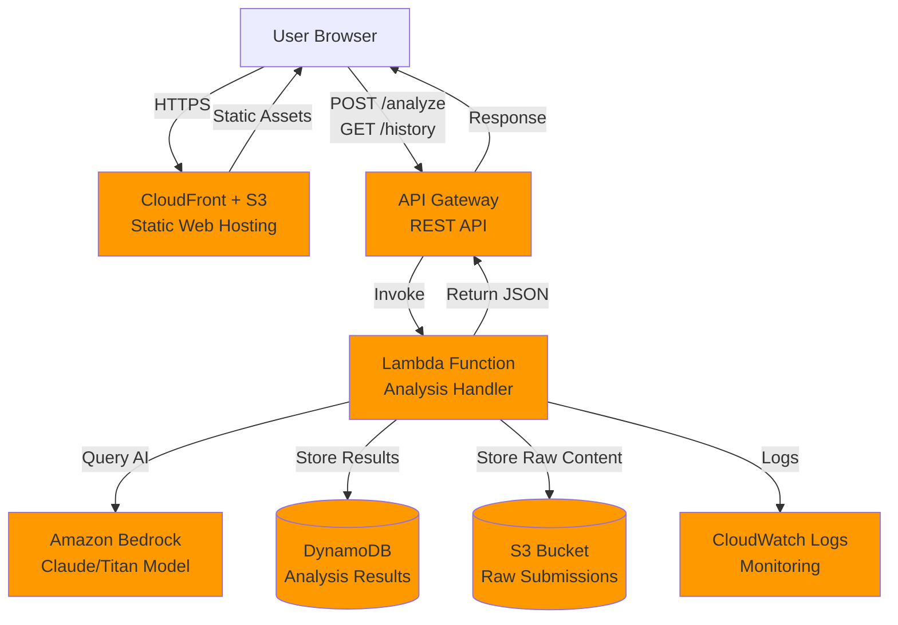

# Design Document: SecureFlow AI

## Overview

SecureFlow AI is a serverless DevSecOps assistant that analyzes infrastructure-as-code and configuration files for security vulnerabilities using Amazon Bedrock. The system follows a three-tier architecture: a React-based frontend hosted on S3/CloudFront, a serverless API layer using API Gateway and Lambda, and a data layer using DynamoDB and S3.

The design prioritizes simplicity, cost-effectiveness (AWS Free Tier), and rapid development (1-2 week timeline) while maintaining production-quality patterns for security and observability.

## Architecture

### High-Level Architecture Diagram



### Data Flow

**Analysis Request Flow:**
1. User submits content via web interface
2. Frontend sends POST request to API Gateway `/analyze` endpoint
3. API Gateway triggers Lambda function with request payload
4. Lambda validates input and stores raw content to S3
5. Lambda constructs prompt and invokes Bedrock API
6. Bedrock analyzes content and returns structured findings
7. Lambda parses Bedrock response and stores results in DynamoDB
8. Lambda returns formatted JSON response to API Gateway
9. API Gateway returns response to frontend
10. Frontend displays risk score and findings to user

**History Retrieval Flow:**
1. User navigates to History page
2. Frontend sends GET request to API Gateway `/history` endpoint
3. API Gateway triggers Lambda function
4. Lambda queries DynamoDB for last 10 analyses (sorted by timestamp)
5. Lambda returns analysis summaries
6. Frontend displays history list with expandable details

## Components and Interfaces

### Frontend (React + TypeScript)

**Technology Stack:**
- React 18 with TypeScript
- Next.js for static site generation
- Tailwind CSS for styling
- Axios for API calls

**Key Components:**
- `AnalysisForm`: Content input, content type selector, submit button
- `ResultsDisplay`: Risk score visualization, findings list with severity badges
- `FindingCard`: Individual finding with expandable details
- `HistoryPage`: List of past analyses with timestamps and scores
- `ErrorBoundary`: Global error handling and user feedback

**State Management:**
- React hooks (useState, useEffect) for local state
- No global state management needed for MVP

### API Gateway

**Configuration:**
- REST API (not HTTP API) for full feature set
- CORS enabled for frontend domain
- Request validation enabled
- Throttling: 10 requests per second, 100 burst
- API key not required (single demo user)

**Endpoints:**

**POST /analyze**
- Integration: Lambda proxy integration
- Timeout: 30 seconds
- Request size limit: 256 KB

**GET /history**
- Integration: Lambda proxy integration
- Timeout: 10 seconds
- Query parameters: `limit` (default: 10, max: 50)

### Lambda Function (Node.js 20.x)

**Function: AnalysisHandler**

**Configuration:**
- Runtime: Node.js 20.x
- Memory: 512 MB (balance between cost and Bedrock API performance)
- Timeout: 30 seconds
- Environment Variables:
  - `BEDROCK_MODEL_ID`: Model identifier (e.g., `anthropic.claude-3-haiku-20240307-v1:0`)
  - `BEDROCK_REGION`: AWS region for Bedrock
  - `DYNAMODB_TABLE_NAME`: Analysis results table name
  - `S3_BUCKET_NAME`: Raw submissions bucket name
  - `MAX_TOKENS`: Maximum tokens for Bedrock response (default: 2000)

**IAM Role Permissions:**
- `bedrock:InvokeModel` on specified model
- `dynamodb:PutItem` on analysis table
- `dynamodb:Query` on analysis table
- `s3:PutObject` on submissions bucket
- `logs:CreateLogGroup`, `logs:CreateLogStream`, `logs:PutLogEvents`

**Handler Structure:**
```typescript
export const handler = async (event: APIGatewayProxyEvent): Promise<APIGatewayProxyResult> => {
  const path = event.path;
  const method = event.httpMethod;
  
  if (method === 'POST' && path === '/analyze') {
    return handleAnalyze(event);
  }
  
  if (method === 'GET' && path === '/history') {
    return handleHistory(event);
  }
  
  return {
    statusCode: 404,
    body: JSON.stringify({ error: 'Not found' })
  };
}
```

### Amazon Bedrock Integration

**Model Selection:**
- Primary: `anthropic.claude-3-haiku-20240307-v1:0`
- Rationale: Fast, cost-effective, excellent at structured output
- Fallback: `amazon.titan-text-express-v1` if Claude unavailable

**Prompt Engineering Strategy:**

**Prompt Template:**
```
You are a security analysis expert. Analyze the following ${contentType} for security and compliance issues.

Content to analyze:
```
${content}
```

Provide your analysis as valid JSON matching this exact schema:
{
  "riskScore": <number 0-100>,
  "summary": "<brief overall assessment>",
  "findings": [
    {
      "title": "<short issue title>",
      "severity": "<LOW|MEDIUM|HIGH|CRITICAL>",
      "category": "<Secrets|IAM|Network|Encryption|Compliance|General>",
      "whyItMatters": "<security impact explanation>",
      "evidence": "<exact quote from content>",
      "recommendedFix": "<actionable remediation>"
    }
  ]
}

Rules:
- Return ONLY valid JSON, no markdown formatting
- riskScore: 0-30 = LOW, 31-60 = MEDIUM, 61-85 = HIGH, 86-100 = CRITICAL
- Include 0-10 findings (prioritize most critical)
- Evidence must be exact quotes from the input
- Be specific and actionable in recommendedFix
```

**Token Optimization:**
- Truncate input content to 4000 characters max
- Set `max_tokens` to 2000 for response
- Use `temperature: 0.3` for consistent, focused output
- No streaming (simpler implementation)

**Structured Output Enforcement:**
- Explicitly request JSON-only output in prompt
- Parse response with try-catch and validation
- If parsing fails, return generic error finding
- Validate schema before returning to user

### DynamoDB Table Schema

**Table Name:** `secureflow-analyses`

**Primary Key:**
- Partition Key: `userId` (String) - Always "demo-user" for MVP
- Sort Key: `timestamp` (Number) - Unix timestamp in milliseconds

**Attributes:**
- `analysisId` (String) - UUID v4
- `userId` (String) - "demo-user"
- `timestamp` (Number) - Unix timestamp (milliseconds)
- `contentType` (String) - "code" | "terraform" | "yaml" | "dockerfile"
- `riskScore` (Number) - 0-100
- `summary` (String) - Brief analysis summary
- `findings` (List) - Array of finding objects
- `findingCount` (Number) - Number of findings (for quick filtering)
- `ttl` (Number) - Optional: Unix timestamp for auto-deletion (30 days)

**Indexes:**
- None required for MVP (single user, simple queries)

**Capacity Mode:**
- On-Demand (auto-scaling, no capacity planning)

**Encryption:**
- AWS-managed keys (default DynamoDB encryption)

**Query Pattern:**
```typescript
// Get last 10 analyses
const params = {
  TableName: 'secureflow-analyses',
  KeyConditionExpression: 'userId = :userId',
  ExpressionAttributeValues: {
    ':userId': 'demo-user'
  },
  ScanIndexForward: false, // Descending order (newest first)
  Limit: 10
};
```

### S3 Bucket Schema

**Bucket Name:** `secureflow-submissions-{account-id}`

**Object Key Structure:**
```
submissions/
  YYYY/
    MM/
      DD/
        {analysisId}.txt
```

**Example:** `submissions/2024/03/15/a1b2c3d4-e5f6-7890-abcd-ef1234567890.txt`

**Object Metadata:**
- `Content-Type`: `text/plain`
- `x-amz-meta-content-type`: Original content type (terraform, yaml, etc.)
- `x-amz-meta-analysis-id`: Analysis ID for correlation
- `x-amz-meta-timestamp`: ISO 8601 timestamp

**Encryption:**
- Server-side encryption with AWS-managed keys (SSE-S3)

**Lifecycle Policy:**
- Transition to Glacier after 30 days
- Delete after 90 days

**Access Control:**
- Block all public access
- Lambda function has PutObject permission only

## Data Models

### API Request/Response Schemas

**POST /analyze Request:**
```typescript
interface AnalyzeRequest {
  content: string;        // Max 50KB
  contentType: 'code' | 'terraform' | 'yaml' | 'dockerfile';
}
```

**POST /analyze Response:**
```typescript
interface AnalyzeResponse {
  analysisId: string;     // UUID
  timestamp: number;      // Unix timestamp (ms)
  riskScore: number;      // 0-100
  summary: string;
  findings: Finding[];
}

interface Finding {
  title: string;
  severity: 'LOW' | 'MEDIUM' | 'HIGH' | 'CRITICAL';
  category: 'Secrets' | 'IAM' | 'Network' | 'Encryption' | 'Compliance' | 'General';
  whyItMatters: string;
  evidence: string;       // Quote from input
  recommendedFix: string;
}
```

**POST /analyze Error Response:**
```typescript
interface ErrorResponse {
  error: string;          // Human-readable error message
  code?: string;          // Error code (e.g., 'VALIDATION_ERROR', 'BEDROCK_ERROR')
}
```

**GET /history Response:**
```typescript
interface HistoryResponse {
  analyses: AnalysisSummary[];
}

interface AnalysisSummary {
  analysisId: string;
  timestamp: number;
  contentType: string;
  riskScore: number;
  findingCount: number;
  summary: string;
}
```

### Internal Data Models

**Bedrock Request:**
```typescript
interface BedrockRequest {
  modelId: string;
  contentType: 'application/json';
  accept: 'application/json';
  body: string;  // JSON stringified
}

interface BedrockRequestBody {
  anthropic_version: 'bedrock-2023-05-31';
  max_tokens: number;
  temperature: number;
  messages: Array<{
    role: 'user';
    content: string;
  }>;
}
```

**DynamoDB Item:**
```typescript
interface AnalysisItem {
  userId: string;         // Partition key
  timestamp: number;      // Sort key
  analysisId: string;
  contentType: string;
  riskScore: number;
  summary: string;
  findings: Finding[];
  findingCount: number;
  ttl?: number;
}
```

## Correctness Properties

*A property is a characteristic or behavior that should hold true across all valid executions of a system—essentially, a formal statement about what the system should do. Properties serve as the bridge between human-readable specifications and machine-verifiable correctness guarantees.*


### Property Reflection

After analyzing all acceptance criteria, I've identified the following consolidations to eliminate redundancy:

**Consolidations:**
1. Properties 4.1-4.6 (individual field presence checks) can be combined into a single comprehensive property that validates all required finding fields
2. Properties 3.3 and 4.7 both validate finding structure - these can be merged
3. Properties 5.2 and 5.3 both validate stored item completeness - these can be combined
4. Properties 6.2 and 6.6 both validate S3 key structure - these can be combined
5. Properties 11.2 and 11.3 both validate HTTP status codes for errors - these can be combined into one property about correct status codes
6. Properties 16.1, 16.2, and 16.3 all validate logging behavior - these can be combined into a comprehensive logging property

**Retained Properties:**
- Input validation properties (2.3, 2.4, 14.6) remain separate as they test different validation scenarios
- Error handling properties (5.5, 6.4, 11.4) remain separate as they test resilience in different components
- Data persistence properties (5.1, 6.1) remain separate as they test different storage systems

### Correctness Properties

Property 1: Input acceptance across content types
*For any* valid text content (code, Terraform, YAML, Dockerfile), the input field should accept and store the content without modification or restriction
**Validates: Requirements 1.2**

Property 2: API call triggered on submission
*For any* non-empty content and valid content type, clicking the analyze button should trigger a POST request to /analyze with the correct payload structure
**Validates: Requirements 1.4**

Property 3: Loading state during processing
*For any* analysis request in progress, the UI should display a loading indicator until the response is received or an error occurs
**Validates: Requirements 1.5**

Property 4: Valid request acceptance
*For any* POST request to /analyze with both content and contentType fields present, the system should accept the request and return a 200 status with structured JSON
**Validates: Requirements 2.2, 2.5**

Property 5: Empty content rejection
*For any* POST request to /analyze where the content field is missing or empty, the system should return a 400 status code with a descriptive error message
**Validates: Requirements 2.3**

Property 6: Invalid content type rejection
*For any* POST request to /analyze where the contentType field is missing or not one of the allowed values, the system should return a 400 status code with a descriptive error message
**Validates: Requirements 2.4**

Property 7: Bedrock invocation with content
*For any* valid analysis request, the system should invoke Amazon Bedrock with a prompt containing the submitted content and content type
**Validates: Requirements 3.1, 3.6**

Property 8: Risk score range validation
*For any* Bedrock response, the extracted risk score should be a number between 0 and 100 (inclusive)
**Validates: Requirements 3.2**

Property 9: Finding structure completeness
*For any* finding in the analysis results, it should include all required fields: title, severity, category, whyItMatters, evidence, and recommendedFix, with each field being non-empty
**Validates: Requirements 3.3, 4.1, 4.4, 4.5, 4.6**

Property 10: Summary field presence
*For any* analysis response, the response should include a non-empty summary field
**Validates: Requirements 3.4**

Property 11: Bedrock failure handling
*For any* Bedrock API failure, the system should return a 500 status code with a user-friendly error message
**Validates: Requirements 3.5, 11.4**

Property 12: Severity enum validation
*For any* finding in the analysis results, the severity field should be exactly one of: LOW, MEDIUM, HIGH, or CRITICAL
**Validates: Requirements 4.2**

Property 13: Category enum validation
*For any* finding in the analysis results, the category field should be exactly one of: Secrets, IAM, Network, Encryption, Compliance, or General
**Validates: Requirements 4.3**

Property 14: Findings array presence
*For any* analysis response, the response should include a findings array (which may be empty)
**Validates: Requirements 4.7**

Property 15: DynamoDB persistence on success
*For any* successful analysis, the system should store the results in DynamoDB with all required fields: analysisId, userId, timestamp, contentType, riskScore, summary, findings, and findingCount
**Validates: Requirements 5.1, 5.2, 5.3**

Property 16: Partition key structure
*For any* item stored in DynamoDB, it should use "demo-user" as the partition key (userId)
**Validates: Requirements 5.4, 10.2**

Property 17: DynamoDB failure resilience
*For any* DynamoDB write failure, the system should log the error but still return the analysis results to the user with a 200 status
**Validates: Requirements 5.5**

Property 18: Content exclusion from DynamoDB
*For any* item stored in DynamoDB, it should not contain the original submitted content
**Validates: Requirements 5.6**

Property 19: S3 persistence on submission
*For any* content submission, the system should store the raw content in S3 with appropriate metadata
**Validates: Requirements 6.1**

Property 20: S3 key structure with date and ID
*For any* S3 object created, the key should follow the format: submissions/YYYY/MM/DD/{analysisId}.txt where YYYY/MM/DD represents the submission date
**Validates: Requirements 6.2, 6.6**

Property 21: S3 metadata inclusion
*For any* S3 object created, it should include metadata fields for content-type, analysis-id, and timestamp
**Validates: Requirements 6.3**

Property 22: S3 failure resilience
*For any* S3 write failure, the system should log the error but continue processing the analysis and return results
**Validates: Requirements 6.4**

Property 23: History result limit
*For any* request to the history endpoint, the system should return at most 10 analyses, ordered by timestamp descending (newest first)
**Validates: Requirements 7.2**

Property 24: History item completeness
*For any* analysis in the history response, it should include timestamp, contentType, riskScore, findingCount, and summary fields
**Validates: Requirements 7.3**

Property 25: History item expansion
*For any* history item clicked in the UI, the system should display the full analysis results including all findings
**Validates: Requirements 7.4**

Property 26: Prompt size limitation
*For any* Bedrock invocation, the prompt should truncate input content to a maximum of 4000 characters to minimize token usage
**Validates: Requirements 9.1**

Property 27: History without user filtering
*For any* history query, the system should return all analyses for the demo user without additional filtering
**Validates: Requirements 10.3**

Property 28: Error response structure
*For any* API error (4xx or 5xx), the response should be valid JSON containing an error field with a descriptive message
**Validates: Requirements 11.1**

Property 29: Correct HTTP status codes
*For any* validation error, the system should return a 400 status code; for any server error, the system should return a 500 status code
**Validates: Requirements 11.2, 11.3**

Property 30: Frontend error display
*For any* error response received by the frontend, the system should display the error message to the user in the UI
**Validates: Requirements 11.5, 11.6**

Property 31: Sensitive data exclusion from logs
*For any* log statement, it should not contain sensitive data patterns such as AWS credentials, API keys, or passwords
**Validates: Requirements 14.5**

Property 32: Input validation before processing
*For any* user input, the system should validate and sanitize it before using it in Bedrock prompts, database queries, or S3 operations
**Validates: Requirements 14.6**

Property 33: Comprehensive logging on operations
*For any* Lambda execution, Bedrock API call, or database operation, the system should log appropriate details including timestamps, operation type, and success/failure status
**Validates: Requirements 16.1, 16.2, 16.3**

Property 34: Error logging with context
*For any* DynamoDB operation failure, the system should log the error with contextual information including the operation attempted and relevant identifiers
**Validates: Requirements 16.5**

## Error Handling

### Error Categories and Responses

**Validation Errors (400):**
- Missing or empty content field
- Missing or invalid contentType field
- Content exceeds size limit (50KB)
- Malformed JSON in request body

**Server Errors (500):**
- Bedrock API failures or timeouts
- JSON parsing errors from Bedrock response
- Unexpected exceptions in Lambda handler

**Partial Failures (200 with warnings):**
- DynamoDB write failures (analysis still returned)
- S3 write failures (analysis still returned)
- Logged but not exposed to user

### Error Response Format

All errors follow consistent JSON structure:
```typescript
{
  "error": "Human-readable error message",
  "code": "ERROR_CODE" // Optional: VALIDATION_ERROR, BEDROCK_ERROR, etc.
}
```

### Frontend Error Handling

- Network errors: Display "Connection failed. Please check your internet connection."
- 400 errors: Display validation message from API
- 500 errors: Display "Analysis failed. Please try again or contact support."
- Timeout errors: Display "Request timed out. Please try with smaller content."

### Retry Strategy

- No automatic retries for user-facing API calls (user can manually retry)
- Bedrock calls: Single attempt (no retry to minimize costs)
- DynamoDB/S3: Single attempt with graceful degradation

### Logging Strategy

- All errors logged to CloudWatch with:
  - Error message and stack trace
  - Request context (analysisId, contentType, content length)
  - Timestamp and Lambda request ID
- Sensitive data (content, credentials) excluded from logs
- Log level: ERROR for failures, WARN for partial failures, INFO for success

## Testing Strategy

### Dual Testing Approach

SecureFlow AI will use both unit tests and property-based tests to ensure comprehensive coverage:

**Unit Tests:**
- Specific examples demonstrating correct behavior
- Edge cases (empty input, maximum size content, special characters)
- Error conditions (Bedrock failures, invalid JSON, network errors)
- Integration points between components
- Mock external services (Bedrock, DynamoDB, S3) for isolated testing

**Property-Based Tests:**
- Universal properties that hold for all inputs
- Comprehensive input coverage through randomization
- Validation of invariants across many executions
- Minimum 100 iterations per property test
- Each test tagged with: **Feature: secureflow-ai, Property {number}: {property_text}**

### Testing Framework

**Frontend:**
- Jest + React Testing Library for unit tests
- fast-check for property-based tests
- Mock API responses for isolated component testing

**Backend:**
- Jest for unit tests
- fast-check for property-based tests
- AWS SDK mocks for DynamoDB, S3, Bedrock
- Supertest for API endpoint testing

### Property Test Configuration

Each property test will:
1. Run minimum 100 iterations with randomized inputs
2. Reference the design document property number
3. Use appropriate generators for input types:
   - Arbitrary strings for content (various sizes, special characters)
   - Enum generators for contentType, severity, category
   - Structured object generators for API requests/responses
4. Validate invariants hold across all generated inputs

### Test Coverage Goals

- Unit test coverage: 80%+ for critical paths
- Property tests: All 34 properties implemented
- Integration tests: End-to-end flow from API to storage
- Error path coverage: All error scenarios tested

### Example Property Test Structure

```typescript
import fc from 'fast-check';

// Feature: secureflow-ai, Property 12: Severity enum validation
describe('Property 12: Severity enum validation', () => {
  it('should only return valid severity values', () => {
    fc.assert(
      fc.property(
        fc.record({
          content: fc.string({ minLength: 1, maxLength: 1000 }),
          contentType: fc.constantFrom('code', 'terraform', 'yaml', 'dockerfile')
        }),
        async (request) => {
          const response = await analyzeContent(request);
          const validSeverities = ['LOW', 'MEDIUM', 'HIGH', 'CRITICAL'];
          
          response.findings.forEach(finding => {
            expect(validSeverities).toContain(finding.severity);
          });
        }
      ),
      { numRuns: 100 }
    );
  });
});
```

## Security Considerations

### Input Validation

**Content Validation:**
- Maximum size: 50KB (enforced at API Gateway and Lambda)
- Character encoding: UTF-8 only
- Sanitization: Remove null bytes, control characters (except newlines/tabs)
- No code execution: Content treated as plain text only

**ContentType Validation:**
- Whitelist: Only allow 'code', 'terraform', 'yaml', 'dockerfile'
- Reject any other values with 400 error
- Case-sensitive matching

### Prompt Injection Prevention

**Bedrock Prompt Safety:**
- User content wrapped in code blocks to prevent prompt injection
- Clear separation between system instructions and user content
- No dynamic prompt construction from user input
- Content truncated to 4000 characters before inclusion

### Rate Limiting and Abuse Prevention

**API Gateway Throttling:**
- 10 requests per second per IP
- 100 burst capacity
- 429 error returned when exceeded

**Lambda Concurrency:**
- Reserved concurrency: 10 (prevent runaway costs)
- Graceful degradation with 503 error when limit reached

**Content Size Limits:**
- API Gateway: 256 KB payload limit
- Application: 50 KB content limit
- Prevents memory exhaustion and excessive Bedrock costs

### Data Protection

**Encryption:**
- In transit: HTTPS/TLS 1.2+ for all API calls
- At rest: S3 server-side encryption (SSE-S3)
- At rest: DynamoDB encryption with AWS-managed keys

**Data Retention:**
- S3: 90-day lifecycle policy (delete after 90 days)
- DynamoDB: Optional TTL (30 days) for automatic cleanup
- No long-term storage of user content

**Access Control:**
- Lambda IAM role: Least-privilege permissions
- S3 bucket: Block all public access
- DynamoDB table: No public access
- API Gateway: No API key required (demo user), but CORS restricted

### Secrets Management

**No Hardcoded Secrets:**
- All AWS credentials via IAM roles
- No API keys in code or environment variables
- Bedrock access via IAM permissions only

**Logging Safety:**
- Content not logged (only metadata: length, type)
- No AWS credentials in logs
- Error messages sanitized (no sensitive data exposure)

### Compliance Considerations

**Data Privacy:**
- No PII collection (no user accounts)
- Content stored temporarily (90-day retention)
- No data sharing with third parties
- Bedrock: AWS data privacy policies apply

**Audit Trail:**
- All API calls logged to CloudWatch
- S3 access logs enabled
- DynamoDB point-in-time recovery enabled (optional)

## Cost Optimization

### AWS Free Tier Alignment

**Lambda:**
- Free Tier: 1M requests/month, 400,000 GB-seconds compute
- Expected usage: ~1,000 requests during competition
- Configuration: 512 MB memory, ~5 second average duration
- Cost: Well within Free Tier

**API Gateway:**
- Free Tier: 1M API calls/month (first 12 months)
- Expected usage: ~1,000 calls during competition
- Cost: Within Free Tier

**DynamoDB:**
- Free Tier: 25 GB storage, 25 WCU, 25 RCU (always free)
- Expected usage: ~1,000 items (~5 MB), on-demand billing
- Cost: Within Free Tier

**S3:**
- Free Tier: 5 GB storage, 20,000 GET, 2,000 PUT (first 12 months)
- Expected usage: ~1,000 files (~50 MB), minimal GET requests
- Cost: Within Free Tier

**Bedrock:**
- No Free Tier, pay-per-token pricing
- Claude 3 Haiku: ~$0.25 per 1M input tokens, ~$1.25 per 1M output tokens
- Expected usage: ~1,000 requests × 1,500 tokens avg = 1.5M tokens
- Estimated cost: ~$2-3 for competition period
- **This is the only service with expected costs**

### Token Optimization Strategies

**Input Token Reduction:**
- Truncate content to 4000 characters (saves ~50% tokens on large files)
- Concise system prompt (avoid verbose instructions)
- No examples in prompt (rely on model's training)

**Output Token Reduction:**
- Set max_tokens to 2000 (sufficient for 5-10 findings)
- Request concise findings (no verbose explanations)
- Use structured JSON (more token-efficient than prose)

**Model Selection:**
- Claude 3 Haiku: Fastest, cheapest, sufficient accuracy
- Avoid Claude 3 Opus/Sonnet (10x more expensive)

### Monitoring and Alerts

**Cost Monitoring:**
- CloudWatch billing alarms at $5, $10, $20 thresholds
- Daily cost reports via AWS Cost Explorer
- Bedrock token usage tracked in CloudWatch metrics

**Usage Monitoring:**
- Lambda invocation count
- DynamoDB read/write capacity units
- S3 storage size and request count
- Alert if approaching Free Tier limits

## Deployment Strategy

### Infrastructure as Code (AWS CDK)

**CDK Stack Structure:**
```
SecureFlowStack
├── Frontend (S3 + CloudFront)
├── API (API Gateway + Lambda)
├── Storage (DynamoDB + S3)
└── Monitoring (CloudWatch)
```

**CDK Advantages:**
- Type-safe infrastructure definitions (TypeScript)
- Reusable constructs for common patterns
- Automatic dependency management
- Easy teardown (destroy stack)

### Deployment Steps

**Prerequisites:**
1. AWS account with Bedrock access enabled
2. AWS CLI configured with credentials
3. Node.js 20.x installed
4. AWS CDK CLI installed (`npm install -g aws-cdk`)

**Initial Deployment:**
```bash
# Install dependencies
cd infra
npm install

# Bootstrap CDK (first time only)
cdk bootstrap

# Deploy stack
cdk deploy

# Output: API Gateway URL, CloudFront URL
```

**Frontend Deployment:**
```bash
# Build frontend
cd web
npm install
npm run build

# Deploy to S3 (automated via CDK)
# CloudFront invalidation triggered automatically
```

**Update Deployment:**
```bash
# Make code changes
# Deploy updates
cd infra
cdk deploy

# CDK automatically updates only changed resources
```

**Teardown:**
```bash
# Delete all resources
cd infra
cdk destroy

# Confirm deletion
# All resources removed (except S3 with retention policy)
```

### Environment Configuration

**CDK Context:**
```json
{
  "bedrockModelId": "anthropic.claude-3-haiku-20240307-v1:0",
  "bedrockRegion": "us-east-1",
  "maxContentSize": 51200,
  "maxTokens": 2000,
  "historyLimit": 10
}
```

**Lambda Environment Variables:**
- Automatically set by CDK from context
- No manual configuration required
- Secrets managed via IAM roles

### Deployment Validation

**Post-Deployment Checks:**
1. API Gateway health check: `curl {API_URL}/health`
2. Frontend accessibility: Visit CloudFront URL
3. Submit test analysis: Verify end-to-end flow
4. Check CloudWatch logs: Verify logging working
5. Verify DynamoDB table created and accessible
6. Verify S3 bucket created with encryption enabled

**Rollback Strategy:**
- CDK maintains previous stack state
- Rollback: `cdk deploy --previous-version`
- Manual rollback: Restore from CloudFormation console

### CI/CD Considerations (Post-MVP)

**Out of scope for MVP, but future enhancements:**
- GitHub Actions for automated testing
- Automated CDK deployment on merge to main
- Separate dev/staging/prod environments
- Automated integration tests in CI pipeline

## Conclusion

This design provides a production-quality, serverless architecture for SecureFlow AI that:
- Meets all functional requirements from the requirements document
- Stays within AWS Free Tier limits (except minimal Bedrock costs)
- Can be built and deployed within 1-2 weeks
- Follows security and observability best practices
- Provides clear testing strategy with property-based testing
- Enables easy demonstration for competition judging

The architecture is intentionally simple to meet MVP timeline while maintaining extensibility for post-competition enhancements.
